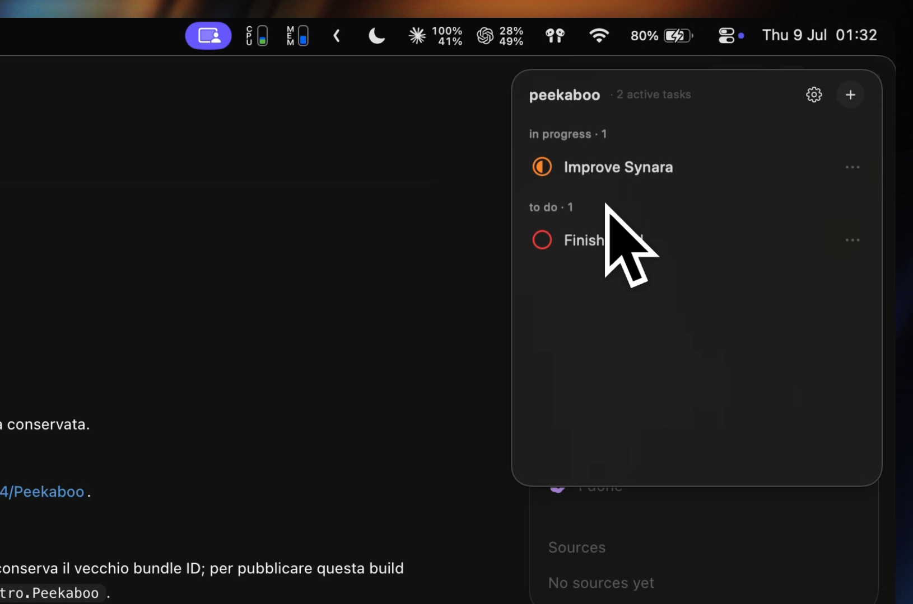

# Peekaboo

A tiny native task list for Mac and iPhone that stays out of the way until you need it.

On Mac, Peekaboo lives in the menu bar and reveals a lightweight panel when the pointer rests in a chosen screen corner. Its iPhone companion uses the same SwiftData model and synchronizes tasks through the user's private CloudKit database.

## Demo



## Features

- Reveals from any screen corner after a configurable delay
- Global `Control–Option–Space` shortcut for creating a task
- Separate Tasks and Backlog scopes, with To do, In Progress and Done states
- None, Low, Medium and High priorities
- Local-first SwiftData persistence with private CloudKit sync
- Native iPhone companion for viewing and editing the same Tasks and Backlog
- Automatic cleanup of completed tasks after the day changes
- Multi-display and full-screen Space support
- Configurable reveal and hide delays
- Optional translucent or solid panel
- Launch at login support
- Native menu bar app with no Dock icon
- Event-driven UI and low-overhead pointer sampling
- Built-in MCP server so local AI agents can read and update tasks

## Requirements

- macOS 14 or newer
- iOS 17 or newer for the iPhone companion
- Xcode 16 or newer

## Build and run

1. Clone the repository.
2. Open `Peekaboo.xcodeproj` in Xcode.
3. Select both the `Peekaboo` and `PeekabooMobile` targets and choose your development team under Signing & Capabilities.
4. Change the bundle identifier if your Apple developer account does not own `com.emanueledipietro.Peekaboo`.
5. Run the `Peekaboo` scheme for Mac or `PeekabooMobile` for iPhone.

Choose a corner and reveal delay in Settings. Press `Control–Option–Space` from anywhere in macOS to reveal Peekaboo with the new-task field focused.
Press `Command–,` while Peekaboo is focused to open Settings.

## iCloud and iPhone setup

Both app targets use the explicit CloudKit container `iCloud.com.emanueledipietro.Peekaboo`. Before running a device build:

1. In Xcode, confirm that both targets use the same Apple development team and have iCloud/CloudKit plus remote-notification capabilities.
2. Create or select `iCloud.com.emanueledipietro.Peekaboo` for both targets. If you change the container identifier, also update `PersistenceController.cloudKitContainerIdentifier` and both entitlement files.
3. Sign in to the same iCloud account on the Mac and iPhone. Each app keeps a local SwiftData replica, so edits remain available offline and synchronize when CloudKit becomes available.
4. After the first Development sync, inspect the generated `CD_TaskItem` type in CloudKit Console. Deploy the schema to Production before TestFlight, App Store or production distribution.

The Mac app makes a one-time `default.store.pre-cloudkit*` backup before first attaching the existing local store to CloudKit. Completed tasks keep the existing cleanup behavior: tasks completed before the current day are deleted, and that deletion synchronizes to every device.

CloudKit pushes are unreliable in Simulator, so the app also refreshes whenever it becomes active and supports pull-to-refresh on iPhone. Final sync validation still requires two real, unlocked devices on the same iCloud account. A directly distributed Mac build needs a Developer ID provisioning profile that contains the iCloud entitlement; ad-hoc signing cannot access the CloudKit container.

### Mac App Store sandbox note

The Release target retains narrowly scoped temporary sandbox exceptions for
`com.apple.cloudd` and `com.apple.duetactivityscheduler`. They are required for
`NSPersistentCloudKitContainer` imports and scheduled exports in the sandboxed
Mac build.

Before App Store submission, add the following under **App Sandbox Entitlement
Usage Information** in App Store Connect:

- Entitlement: `com.apple.security.temporary-exception.mach-lookup.global-name`
- Values: `com.apple.cloudd`, `com.apple.duetactivityscheduler`
- Usage: “Allows Peekaboo's sandboxed macOS app to access the system CloudKit
  daemon and background activity scheduler used by
  `NSPersistentCloudKitContainer`, so private task changes can be imported from
  and exported to the user's iCloud account. Reviewers can assess it by editing
  a task on the iPhone companion and confirming that the change appears in the
  Mac app, then editing it on Mac and confirming the reverse sync.”
- Include the Feedback Assistant ID associated with the macOS sandbox issue.

## Interactions

- Double-click a To do task to move it to In Progress.
- Double-click an In Progress task to move it back to To do.
- Click or double-click a Backlog idea to promote it to To do.
- Click the priority-colored circle to complete a task.
- Click the circle on a completed task to restore it.
- Drag tasks to reorder them within the same status and priority group.
- Drag a task into another app to insert its title as plain text.
- Use the trailing ellipsis to edit, move, reprioritize or delete a task.

## Agent access (MCP)

When Agent access is explicitly enabled, Peekaboo serves the [Model Context Protocol](https://modelcontextprotocol.io) over Streamable HTTP at `http://127.0.0.1:7335/mcp`, loopback only. The feature is disabled by default and every request must include the random bearer token shown under Settings → Agent access. Authorized clients such as Claude Code, Synara, Codex or Cursor can list, create, update, complete and delete tasks, and every change appears live in the panel. Change the port with `defaults write com.emanueledipietro.Peekaboo agentServerPort <port>`.

Tools: `list_tasks`, `create_task`, `update_task` (set `status` to `done` to complete), `delete_task`. Statuses are `todo`, `inProgress`, `done`, `backlog`; priorities are `none`, `low`, `medium`, `high`.

Claude Code / Synara (available in every project via `--scope user`):

```sh
claude mcp add --transport http --scope user \
  --header "Authorization: Bearer <TOKEN FROM SETTINGS>" \
  peekaboo http://127.0.0.1:7335/mcp
```

or in a project's `.mcp.json`:

```json
{
  "mcpServers": {
    "peekaboo": {
      "type": "http",
      "url": "http://127.0.0.1:7335/mcp",
      "headers": {
        "Authorization": "Bearer <TOKEN FROM SETTINGS>"
      }
    }
  }
}
```

Codex, in `~/.codex/config.toml`:

```toml
[mcp_servers.peekaboo]
url = "http://127.0.0.1:7335/mcp"
bearer_token_env_var = "PEEKABOO_MCP_TOKEN"
```

Set `PEEKABOO_MCP_TOKEN` to the token shown in Peekaboo before starting Codex.

Older Codex builds without authenticated Streamable HTTP support must be updated before connecting to Peekaboo.

## Tests

```sh
xcodebuild test \
  -project Peekaboo.xcodeproj \
  -scheme Peekaboo \
  -destination 'platform=macOS'

xcodebuild test \
  -project Peekaboo.xcodeproj \
  -scheme PeekabooMobile \
  -destination 'platform=iOS Simulator,name=iPhone 17 Pro'
```

## Project generation

`Scripts/generate_project.rb` atomically generates the Xcode project using the Ruby `xcodeproj` gem and stable UUIDs. Run it after adding source files that need to be included in the project. Use `--help` to inspect the command without changing the project, or `--output PATH` to generate a separate copy.

Run `ruby Scripts/verify_project_generation.rb` to confirm that two consecutive generations are identical.

## License

Peekaboo is available under the [MIT License](LICENSE).
